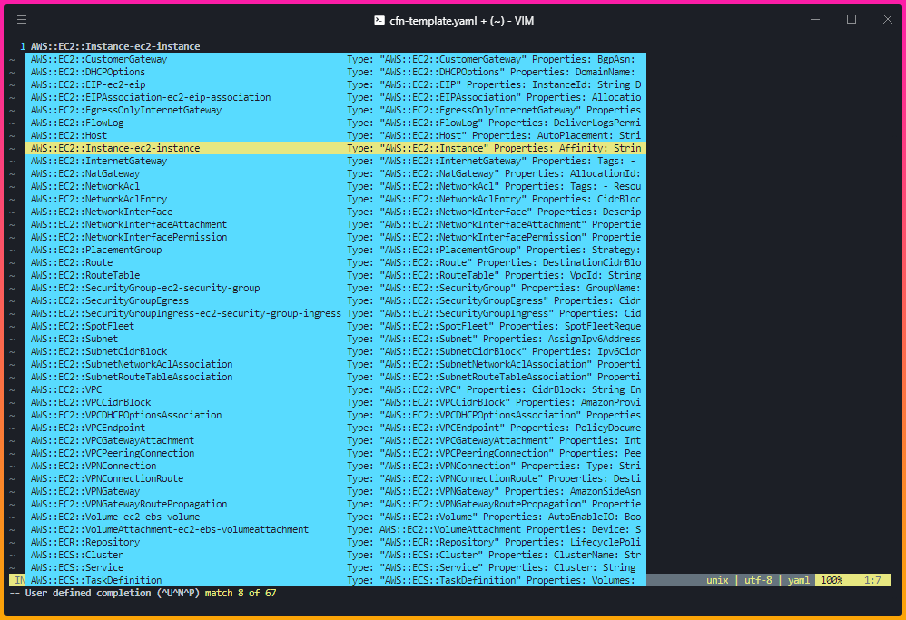
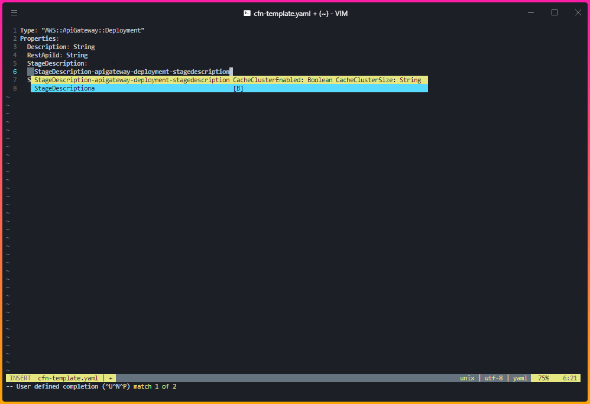

# aws-cfn-snippet.vim

## Make yaml and json snippet file for AWS CloudFormation.

you need [Shougo/neosnippet](https://github.com/Shougo/neosnippet.vim) Plugin.
check your snippet directory in vimrc.

```bash:vimrc
let g:neosnippet#snippets_directory='~/.vim/snippets/'
```

Add snip files(`yaml.snip, json.snip`) in your snippet file or directory.

```bash
cat yaml.snip >> ~/.vim/snippet/yaml.snip
cat json.snip >> ~/.vim/snippet/json.snip
```

## Sample




## Trouble shooting

Q. display `^### ${filetype^^}: bad substatution`  
A. This regexp require bash 4.x later. So update your bash version.

Q. display `sed: RE error: illegal byte sequence`  
A. execute `export LC_ALL=C`  
